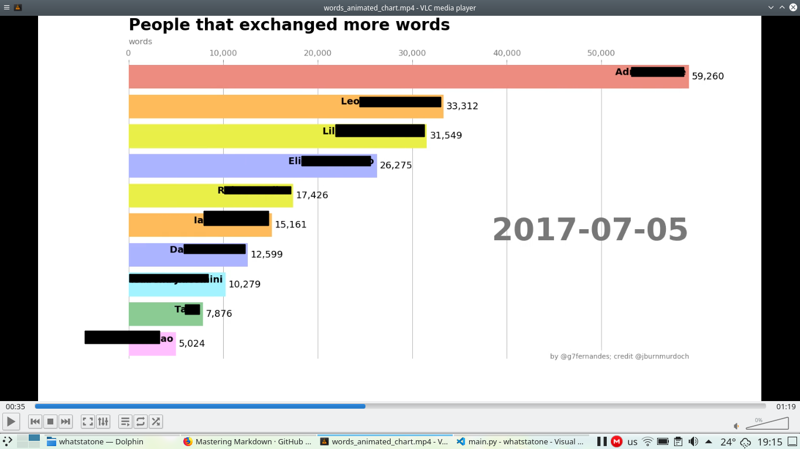

# whatstatone

This program uses backup .txt files from whatsapp to build animated bar charts of people
that exchanged more messages and words with you. This program can be run in Linux and Mac OS directly. Users of Windows
need to edit the lines in the program that paths are used (change for exemple foo/bar to foo\\bar) .

How it works

- Use the export option in WhatsApp to export the .txt of your chats. You can choose "without media" to make it quicker. 
- Rename the files with nice names. It will be used to label the bar chart. Do not use names with over 50 characters. 
- Put all exported .txt files inside a folder named "msg" in the *same directory where main.py is* !
- If you want to rank the messages sent of a group, save the group backup file in the same directory of main.py or enter the full path to the file when it is asked 
- Run main.py 

It will save as output bar charts of accumulative messages or words exchanged. 

Requirements:
python 3 with matplotlib, numpy and pandas (you can get it all with Anaconda Python or used pip module per module)
ffmpeg 

